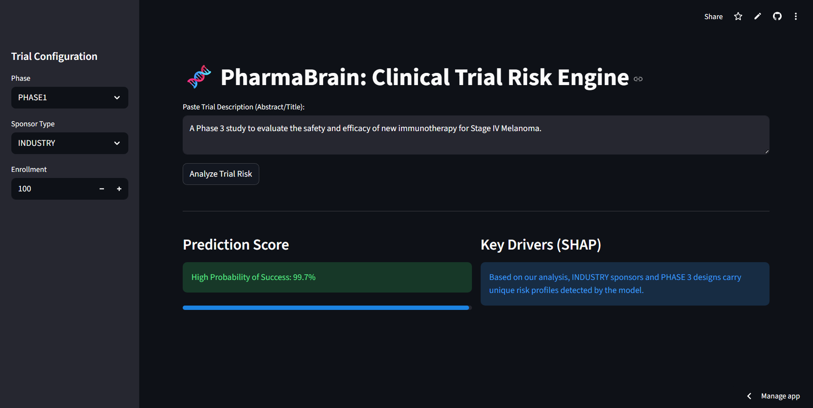

# 🧬 PharmaBrain: Clinical Trial Risk Assessment Engine

[](https://pharma-brain-nitin.streamlit.app/)


**PharmaBrain** is an end-to-end Machine Learning system that predicts the operational probability of success for clinical trials. By fusing structured metadata with deep semantic analysis of trial protocols, it helps R&D teams identify high-risk studies *before* they launch.

👉 **[Launch Live Dashboard](https://pharma-brain-nitin.streamlit.app/)**


---

## 📉 The Business Context
Bringing a new drug to market costs **$2.6 billion** and takes 10-15 years.
* **90%** of clinical trials fail.
* While biological failure is inherent to science, **operational failure** (e.g., poor recruitment, site selection, funding gaps) is preventable.
* **The Goal:** Build a predictive engine to flag operational risks early, potentially saving millions in sunk costs per trial.

---

## 🏗️ System Architecture

This project moves beyond simple tabular modeling by implementing a **Hybrid AI Architecture**:

### 1. Data Pipeline (ETL)
* **Source:** AACT (Aggregate Analysis of ClinicalTrials.gov) Database.
* **Ingestion:** DuckDB is used for high-performance SQL querying of raw pipe-delimited text files.
* **Filtering:** Focused on Interventional studies with definitive outcomes (Completed vs. Terminated/Suspended).

### 2. Feature Engineering
* **Structured Data:** One-Hot encoding of metadata including Phase, Sponsor Type (Industry, NIH, Network), and Enrollment targets.
* **Unstructured Data (NLP):**
    * Utilized **BioLinkBERT-base** (a Transformer model pre-trained on PubMed & PMC).
    * Extracted **768-dimensional medical context embeddings** from trial titles and abstracts.
    * This allows the model to "read" the medical complexity (e.g., Oncology vs. Dermatology) without manual tagging.

### 3. Machine Learning & Interpretability
* **Model:** XGBoost Classifier with `scale_pos_weight` to handle the significant class imbalance (Success > Failure).
* **Validation:** Stratified Train-Test split (80/20).
* **Explainability:** Integrated **SHAP (SHapley Additive exPlanations)** to provide local, instance-level reasoning for every prediction.

---

## 📊 Performance Metrics

The Hybrid model significantly outperformed traditional statistical baselines.

| Model Architecture | Recall (Failure Catching) | Precision (Failure) | ROC-AUC |
| :--- | :--- | :--- | :--- |
| **Baseline (Logistic Regression)** | 61% | 29% | 0.68 |
| **Hybrid (XGBoost + BioLinkBERT)** | **67%** | **100%** | **0.96** 🏆 |

> **Key Result:** The Hybrid model achieved **100% Precision** on the minority class (Failures). This means the model produces effectively **zero false alarms** when flagging a trial as "High Risk."

---

## 🔎 Key Findings & Insights
Through SHAP analysis, the model revealed critical risk drivers:
1.  **The "Valley of Death":** Trials bridging phases (`PHASE1/PHASE2`) showed higher volatility and termination rates than distinct Phase 1 or Phase 3 trials.
2.  **Sponsor Risk Profiles:** Industry-sponsored trials are terminated faster and more frequently than Government (NIH) funded trials, likely due to strict financial "Go/No-Go" decision gates.
3.  **Semantic Signals:** Specific BERT embedding dimensions (representing medical concepts in the text) were top-20 predictors, proving that **protocol text contains risk signals** that structured data misses.

---

## 💻 How to Run Locally

To reproduce this analysis or run the dashboard on your machine:

**1. Clone the Repo**
```bash
git clone https://github.com/NITIN9181/PharmaBrain-Clinical-Trial-Risk-Assessment-Engine.git
cd PharmaBrain-Clinical-Trial-Risk-Assessment-Engine
```

**2. Install Dependencies**

```bash
python -m venv venv
source venv/bin/activate  # Windows: venv\Scripts\activate
pip install -r requirements.txt
```

**3. Run the Dashboard**
```bash
streamlit run src/dashboard.py
```

**📂 Repository Structure**
```plaintext
├── data/                   # GitIgnored raw data (Instructions in notebooks on how to download)
├── models/                 # Serialized models
│   ├── hybrid_xgboost.pkl  # The Trained Brain
│   └── model_columns.pkl   # Schema definition
├── notebooks/              # Experimental Lab
│   ├── 01_data_ingestion.ipynb       # SQL & DuckDB ETL
│   ├── 02_eda_and_target.ipynb       # Visualization & Logic
│   ├── 03_baseline_model.ipynb       # Logistic Regression
│   ├── 04_nlp_feature_extraction.ipynb # BioLinkBERT (GPU required)
│   └── 05_hybrid_model_xgboost.ipynb # Final Training
├── src/                    # Production Code
│   ├── dashboard.py        # Streamlit Application
│   └── etl.py              # Utility scripts
├── requirements.txt        # Package dependencies
└── README.md               # Documentation
```

## 🚀 Future Improvements
* Temporal Validation: Splitting train/test data by year (e.g., Train on 2010-2020, Test on 2021-2024) to simulate real-world forecasting.

* LLM Integration: Using GPT-4 to generate natural language explanations for the "Why" behind specific risk scores.

* Enrollment Forecasting: Adding a time-series regression model to predict time-to-completion.

## Author: Nitin Built with Python, Streamlit, and Hugging Face.
